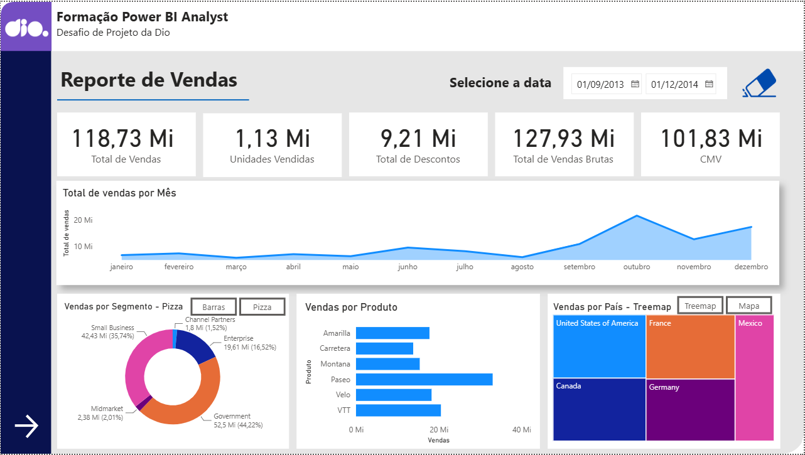
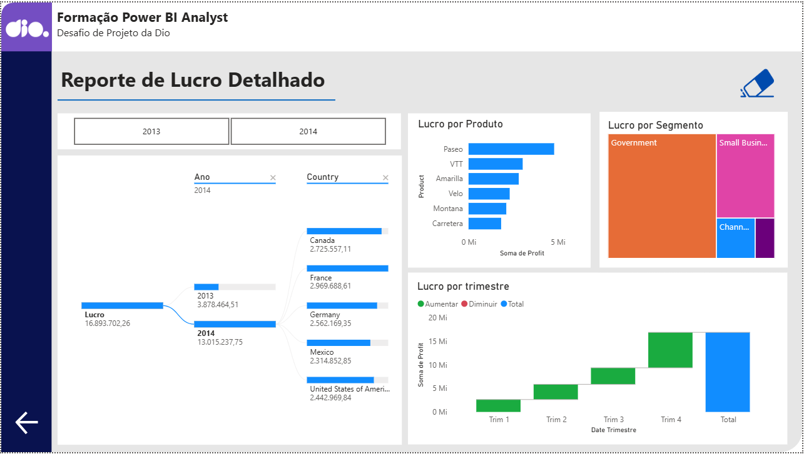

# 📊 Relatório Power BI — Desafio de Visualização de Dados

## 🎯 Sobre o Projeto
Este repositório contém a solução desenvolvida para um desafio prático de Power BI. O objetivo principal do projeto foi a **replicação e aprimoramento visual** de um painel gerencial a partir de uma base de dados previamente estruturada.

O foco técnico desta entrega esteve concentrado em:
- **Design de Interface (UX/UI):** Organização de layout e hierarquia de informações.
- **Visualização de Dados:** Escolha estratégica de gráficos para maximizar a clareza dos indicadores.
- **Capacidade Autônoma:** Execução e resolução do desafio proposto na segunda página, além de melhorias implementadas em ambas as páginas.

---

## 📊 Estrutura do Relatório

O arquivo `Reporte_Vendas.pbix` está dividido em duas páginas:

1. **Página 1 — Reporte de Vendas (Processo Guiado):** 
   - Replicação passo a passo da estrutura demonstrada no vídeo instrucional com melhorias detalhadas na seção seguinte.
   - Apresentação de métricas e indicadores de vendas através de cartões e visuais diversificados.
   - Inclusão de botões para alternar a navegação entre visões de vendas por país e segmento.
   - Aplicação de segmentadores de dados para navegação interativa.

  

2. **Página 2 — Reporte de Lucro (Replicação Independente):**
   - Replicação autônoma dos visuais solicitados para atender aos objetivos do desafio, também acompanhada de melhorias de navegação.
   - Aplicação de segmentadores interativos.

 

 3. **Navegação Pelas Funcionalidades do Relatório:**

---

## 🚀 Aprimoramentos e Diferenciais Implementados

Para ir além do escopo mínimo solicitado e agregar mais valor à experiência do usuário, foram aplicadas as seguintes melhorias:

- **Localização de Idioma:** Padronização completa das nomenclaturas de gráficos, cartões, abas e títulos para o português brasileiro.
- **Correção de Redundância e Lógica de KPI:** O cartão "Total de Descontos" aparecia duplicado na aba 1. Substituí o elemento duplicado pelo "Total de Vendas Brutas", resolvendo a ambiguidade visual para que o usuário não subtraia o desconto de um valor de venda que já era líquido.
- **Usabilidade (UX):** Replicação do botão de "Limpar Filtros" para a segunda página do relatório, permitindo resetar a visualização com um clique (recurso ausente no modelo original).

---

## 🛠️ Tecnologias e Ferramentas

- **Power BI Desktop:** Construção do relatório e componentes visuais.
- **Base de Dados:** Planilha de dados estruturada fornecida pelo desafio.

---

## 📈 Próximos Passos (Plano de Evolução Técnica)

Como parte do meu plano de desenvolvimento contínuo na área de Análise de Dados, os próximos passos previstos para este ou novos projetos incluem:

- [ ] Aplicação de linguagem **DAX** para criação de métricas calculadas e medidas dinâmicas.

---

## 📂 Como Visualizar

1. Faça o download do arquivo `Reporte_Vendas.pbix` disponível neste repositório.
2. Abra o arquivo no **Power BI Desktop**.
3. Navegue entre as páginas para explorar o relatório.
